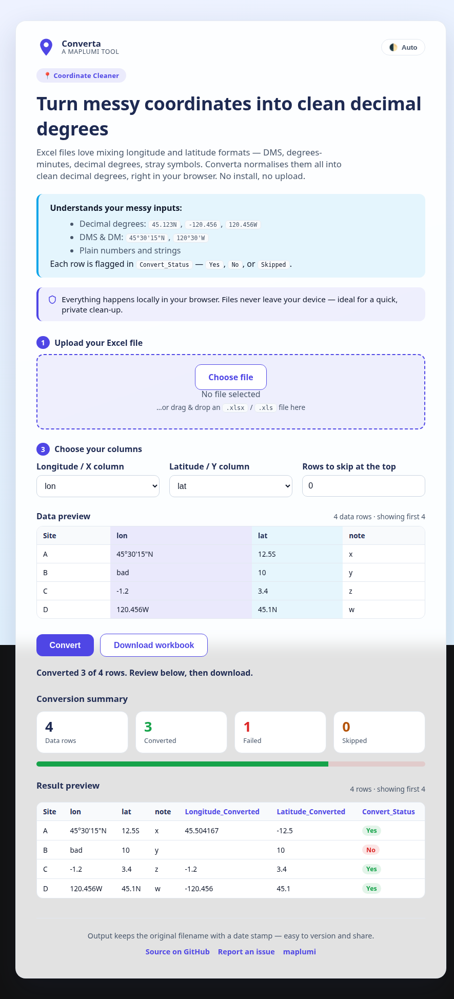
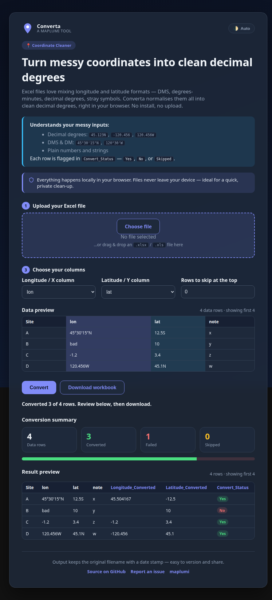

# Converta


Ever struggled with Excel files containing longitude and latitude values in every format imaginable? **Converta** is a friendly, minimal tool that transforms mixed coordinate formats into clean decimal degrees — making your data instantly ready for mapping, analysis, or sharing.



> Dark mode and full preview, captured live:



## What Converta Does

- **Upload** your Excel file (`.xlsx`, `.xls`) — or drag &amp; drop it
- **Pick the worksheet** when a workbook has several tabs
- **Autodetect** longitude and latitude columns (adjust if needed)
- **Preview your data** before converting, with the chosen lon/lat columns highlighted
- **Convert** coordinates to decimal degrees
- **See a summary** of how many rows converted, failed, or were skipped
- **Download** a new Excel file with:
  - `Longitude_Converted`
  - `Latitude_Converted`
  - `Convert_Status` (`Yes` when both coordinates convert, `No` when they do not, `Skipped` for rows above the header)
- **Date-stamped** output filename for easy tracking
- **Skip** the first *n* rows in the web version when you want to ignore headers or notes
- **Light / dark / auto theme** that remembers your choice

## Supported Coordinate Formats

Converta automatically handles:

- Decimal Degrees: `45.123N`, `-120.456`, `120.456W`
- Degrees, Minutes, Seconds (DMS): `45°30'15"N`, `120°30'15"W`
- Degrees and Minutes: `45°30'N`, `120°30'W`
- Plain numbers: `45.123`, `-120.456`

Rows that cannot be converted are marked `Convert_Status = No`, and rows you skip are marked `Convert_Status = Skipped`.

## Web Version (recommended)

- Use Converta online at **[maplumi.github.io/converta](https://maplumi.github.io/converta/)**.
- Choose your Excel file, pick the longitude and latitude columns, and optionally enter how many leading rows to skip.
- **All parsing happens in your browser** — no files are uploaded or stored anywhere.
- Review the live data preview and the conversion summary, then download the converted workbook with a date-stamped filename.
- A link back to the source code is included on the page for easy forking and enhancements.

## Desktop Version

A self-contained Python/Tkinter app (`main.py`) provides the same conversion offline.

### Requirements

- Python 3.8 or newer
- [pandas](https://pandas.pydata.org/) and [openpyxl](https://openpyxl.readthedocs.io/) (openpyxl reads/writes `.xlsx`)
- Tkinter (bundled with most Python installers; on Debian/Ubuntu install `python3-tk`)

### Setup

```sh
pip install pandas openpyxl
```

### Run it

On Windows, double-click `converta.bat`, or from any terminal:

```sh
python main.py
```

Then:

1. Click **Browse…** to select your Excel file
2. Confirm or adjust the detected coordinate columns
3. Click **Convert**
4. Find your converted file in the same folder, with a date-stamped name and a quick conversion summary
5. Click **Close** to exit

## Project Layout

| Path              | What it is                                         |
| ----------------- | -------------------------------------------------- |
| `docs/index.html` | The browser app served via GitHub Pages            |
| `main.py`         | The desktop Tkinter app + the shared parsing logic |
| `converta.bat`    | Windows convenience launcher for the desktop app   |

## Contributing

Issues and pull requests are welcome at [github.com/maplumi/converta](https://github.com/maplumi/converta).

## License

[MIT](LICENSE)
